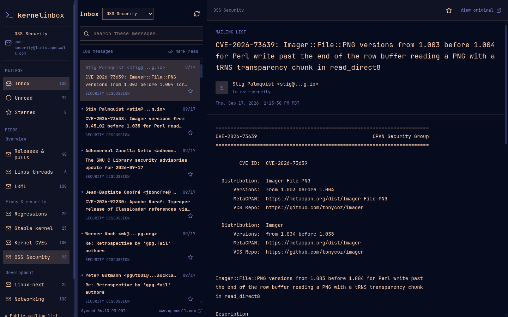
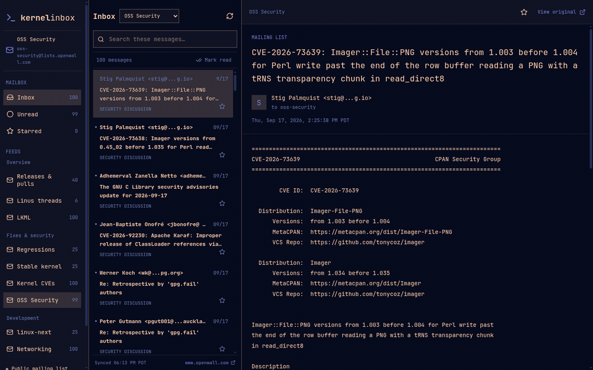

# Kernel Inbox

A local, read-only inbox for Linux kernel and security mailing lists. Run it on your own computer and open http://127.0.0.1:8765. No account, API key, or hosted service is required.



### Adjustable panes

Drag either divider to make room for your feeds, message list, or reading pane. Kernel Inbox remembers your pane widths in this browser. You can also focus a divider with Tab and resize it with the arrow keys.



## Quick start

Requires **Python 3.11+** and **Node.js 22.13+ with npm**. Linux and macOS can use the commands below; on Windows use `py -3` instead of `python3`. Start-at-login integration is optional and requires Linux with systemd.

Clone this repository from GitHub, enter its directory, then run:

```sh
npm ci
npm run build
python3 server.py
```

Open http://127.0.0.1:8765. Stop the server with Ctrl+C. Python uses only its standard library; Node is needed for building and development.

## What it does

Kernel Inbox brings recent kernel development and security discussions into an email-style interface. Browse a feed, open a message, follow its conversation, and keep track of what you have read.

- **Customizable feeds:** add public RSS 2.0 or Atom feeds, rename or remove feeds, restore built-in feeds, and create, rename, or remove categories from Settings. Removing a category keeps its feeds under Uncategorized.
- **Personal appearance:** choose desktop, dark, or light colors, reading text size, message spacing, and timezone from the settings cog beside Refresh.
- **Review before saving:** settings changes, including feed removals, stay in a draft until you choose Apply or OK. Cancel discards unapplied changes.
- **Nine built-in feeds:** LKML, Linus threads, kernel CVEs, OSS Security, regressions, stable, linux-next, networking, and releases & pull requests.
- **Adjustable layout:** edge-to-edge panes with draggable desktop dividers and remembered widths. Use Tab and arrow keys to resize with the keyboard; narrow windows keep a compact layout.
- **Readable discussions:** full messages, archive-provided conversation links, and colored quotes and patch lines.
- **A personal reading queue:** unread counts, starred messages, header search, and a remembered feed selection.
- **Local state:** read/starred preferences stay in your browser; archive responses are cached on your computer and remain available when an upstream archive is unreachable.
- **Desktop-friendly defaults:** browser-local timestamps, a built-in theme, optional Omarchy palette integration, and optional Linux start-at-login support.

The server listens only on `127.0.0.1`. Archive content is rendered as text, without archive scripts or HTML. Kernel Inbox is a reader: use “View original” to visit the source archive.

## Customize your inbox

Open the **settings cog beside Refresh**. Settings has three sections:

| Section | Controls |
| --- | --- |
| Appearance | Desktop theme, Ethereal dark, or Light; reading text size; message spacing; display timezone |
| Feeds | **Add feed** at the top; add a built-in source or a public RSS/Atom URL; rename feeds, change their categories, or remove them |
| Categories | Add a category above the list; rename or remove existing categories |

For a custom feed, open **Feeds → Add feed**, choose its category, enter a name and RSS/Atom URL, then click **Add feed** to check the URL and add it to your draft. Removed built-in feeds can be added again from the built-in feed selector.

The buttons at the bottom stay visible while scrolling:

- **Apply** saves your changes and keeps settings open.
- **OK** saves your changes and closes settings.
- **Cancel**, Escape, the close button, or clicking outside the panel discards changes made since the last Apply.

Feed removals are shown as pending until you save. Removing a category keeps its feeds under **Uncategorized**. Invalid timezones, blank names, and unfinished add-feed/category forms must be resolved before saving. If browser storage cannot save your changes, settings stays open with the draft intact.

Preferences are saved in the current browser, with no account or cross-device sync. Existing read/starred state and pane widths are retained. To follow your browser's timezone, leave the timezone field blank; otherwise enter an IANA name such as `UTC` or `America/Los_Angeles`. Timezone changes affect display times, not the built-in feeds' UTC date windows.

## Feeds and archive behavior

| Feed | Source and behavior |
| --- | --- |
| Linux kernel | Recent LKML.org messages |
| Linus threads | Conversations with posts by Linus Torvalds from the past seven UTC calendar days |
| Kernel CVEs | linux-cve-announce via lists.openwall.net |
| OSS Security | oss-security via Openwall |
| Regressions, Stable, linux-next | Atom feeds from the public Lore mirror at lore.kernel.ime.usp.br |
| Networking | netdev via lists.openwall.net |
| Releases & pulls | Original Linux version announcements and `[GIT PULL]` / `[PULL]` requests from seven UTC calendar days of LKML |

Custom feeds must use a public HTTP or HTTPS URL on port 80 or 443. RSS 2.0 and Atom are supported, with a 5 MB response limit and up to 100 entries. Content is displayed as plain text; use “View original” for the full article. Private-network URLs and redirects to them are rejected. Feed preferences are per browser; cached responses stay on this computer. Removing a feed keeps its read/starred history if it is added again.

Feeds refresh every five minutes and display up to 100 recent messages; upstream Atom feeds may return fewer. The Lore mirror can lag the primary archive. Search applies to loaded sender and subject headers, and sender profiles cover recent messages and the local cache rather than complete posting histories.

Linus threads open at his latest matching post and share read/starred state with LKML, as does the releases feed. Where LKML.org redacts addresses, Linus matching uses the exact archive sender name; mentions and CC-only participation do not qualify. Follow “In this conversation” to read other participants. Entries without full timestamps retain their archive dates until opened.

## Configuration

| Setting | Default | How to set it |
| --- | --- | --- |
| Port | `8765` | `python3 server.py --port 8766` or export `KERNEL_INBOX_PORT` |
| Cache directory | `.cache/` in the checkout | Export `KERNEL_INBOX_CACHE_DIR` |
| Theme | Detect Omarchy, otherwise Ethereal | Choose Desktop theme, Ethereal dark, or Light in Settings → Appearance. Export `KERNEL_INBOX_THEME=default` to disable desktop palette detection. |
| Display timezone | Browser timezone | Open Settings → Appearance, enter an IANA timezone such as `UTC` or `America/Los_Angeles`, then choose Apply or OK. Leave blank to follow the browser. `NEXT_PUBLIC_TIME_ZONE` remains a build-time default. |

Python runtime settings must be exported in the shell; the server does not load `.env` files. Keep the default port to retain access to existing browser read/starred state: browser storage is tied to the exact origin, including hostname and port.

## Start at login (optional, Linux)

After building, stop any manually running server and run:

```sh
python3 scripts/install-service.py --print  # preview paths without installing
python3 scripts/install-service.py
systemctl --user status kernel-inbox
```

The installer generates a service for this checkout and Python executable. An existing service is backed up as `kernel-inbox.service.bak`; it refuses to overwrite an existing backup. Existing symlinks are preserved as backup links and replaced with a generated service file, leaving their targets untouched. Install using the script above: the repository's `kernel-inbox.service` is a template and cannot be used directly. The service starts when you log in. Keep the checkout in place, or reinstall after moving it.

To customize runtime settings, run `systemctl --user edit kernel-inbox` and add, for example:

```ini
[Service]
Environment=KERNEL_INBOX_PORT=8766
Environment=KERNEL_INBOX_THEME=default
```

Then run `systemctl --user restart kernel-inbox`.

## Development

Run the Python server in one terminal and the frontend in another:

```sh
python3 server.py
# In another terminal:
npm run dev -- --host 127.0.0.1
```

Use the development URL printed by Vite. Its `/api` requests proxy to the Python server. If using a custom backend port, export the same `KERNEL_INBOX_PORT` in both terminals.

```sh
npm test
npm run typecheck
npm run build
```

The Python server serves the exported `dist/client/` directory. The frontend uses React, Vinext, and Vite. GitHub Actions runs the offline Python tests, TypeScript checks, and production build. See [CONTRIBUTING.md](CONTRIBUTING.md).

If installation encounters a system libvips conflict, retry with `SHARP_IGNORE_GLOBAL_LIBVIPS=1 npm ci`.

## Updating and uninstalling

To update, stop the server (or use `systemctl --user stop kernel-inbox`), pull the latest source with `git pull`, run `npm ci` and `npm run build`, and start it again.

To remove the optional service:

```sh
systemctl --user disable --now kernel-inbox
rm "${XDG_CONFIG_HOME:-$HOME/.config}/systemd/user/kernel-inbox.service"
systemctl --user daemon-reload
```

You can then delete the checkout. If you used service overrides or a custom cache directory, remove those separately when no longer needed. Clear site data in your browser to remove read/starred state.

## Repository layout

- `app/`, `components/`, `hooks/`, `lib/`, `public/`: frontend source and assets.
- `server.py`: archive adapters, cache, optional theme integration, and local HTTP server.
- `custom_feeds.py`: public RSS/Atom retrieval, destination checks, and text extraction.
- `test_server.py`, `test_custom_feeds.py`: offline parser, cache, destination-validation, and server tests.
- `scripts/install-service.py`, `kernel-inbox.service`: optional systemd integration.
- `.github/workflows/checks.yml`: continuous integration.

Generated builds, dependencies, caches, environment files, and local Sites metadata are excluded from Git.

## Data limitations

This is a rolling recent-mail reader, not a complete indexed archive. LKML.org controls freshness and may lag or truncate header subjects. The full subject appears when a message opens. Cache is retained when the upstream is unavailable, and the UI labels stale data. Security lists use Openwall public archives, which may redact sender addresses and truncate index subjects. Full subjects appear when opened. Adjacent Openwall messages are not presented as conversation replies.

## License

Kernel Inbox is licensed under the [MIT License](LICENSE). Third-party dependencies and mailing-list content retain their own licenses and rights.
